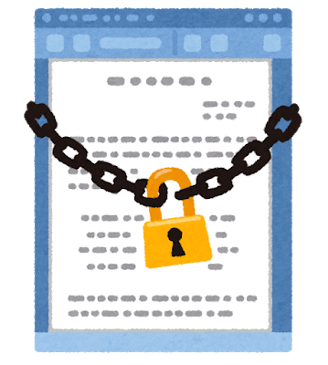

# ドメイン設定 / HTTPS対応

ドメイン名を取得し、`https-portal`というDockerコンテナを使用して、HTTPSに対応します。



---

## ドメイン名の取得

HTTPS設定のためにドメイン名を取得します。

- 別紙「[Freenom で無料のドメイン名を取得する](./freenom.md)」を参照

---

## 設定ファイルの変更

```
host = __YOUR_GREAT_DOMAIN_NAME__
```
`target/nodes/api-node/userconfig/resources/config-node.properties`を開き、
`host`の部分に取得したドメイン名を入力します。

---

## コンテナ設定の追記

```yaml
    https-portal:
        container_name: https-portal
        image: steveltn/https-portal:1
        ports:
            - "80:80"
            - "3001:443"
        restart: 'on-failure:2'
        environment:
            WEBSOCKET: 'true'
            STAGE: production
            DOMAINS: '__YOUR_GREAT_DOMAIN_NAME__ -> http://rest-gateway:3000'
            # STAGE: local
            # DOMAINS: 'localhost -> http://rest-gateway:3000'
        depends_on:
            - rest-gateway
```
`target/docker/docker-compose.yml`を開き、`rest-gateway:`の後ろに追記します。

---

## ノードの再起動

```shell
# systemctl restart symbol-platform
```
`Symbol`関連のコンテナ郡が再起動すると同時に、
追加した`https-portal`コンテナが自動的に証明書の取得から設定までを行います。

---

## https通信の確認

```shell
# curl https://__YOUR_GREAT_DOMAIN_NAME__:3001/node/info
# curl https://__YOUR_GREAT_DOMAIN_NAME__:3001/chain/info
```
`curl`またはブラウザにて、アクセスして疎通の確認をします。
