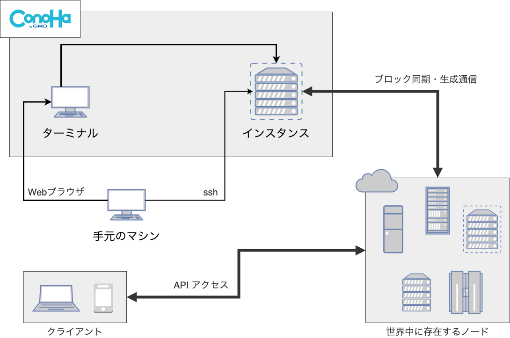
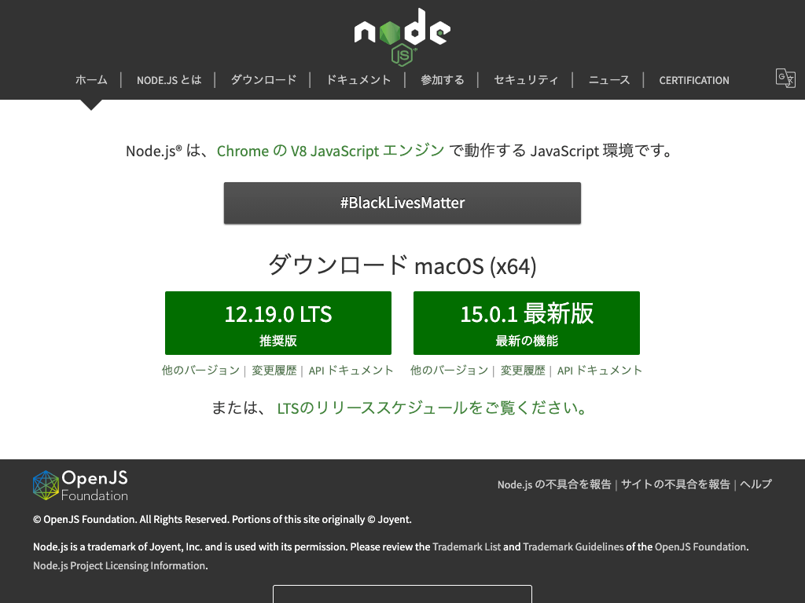
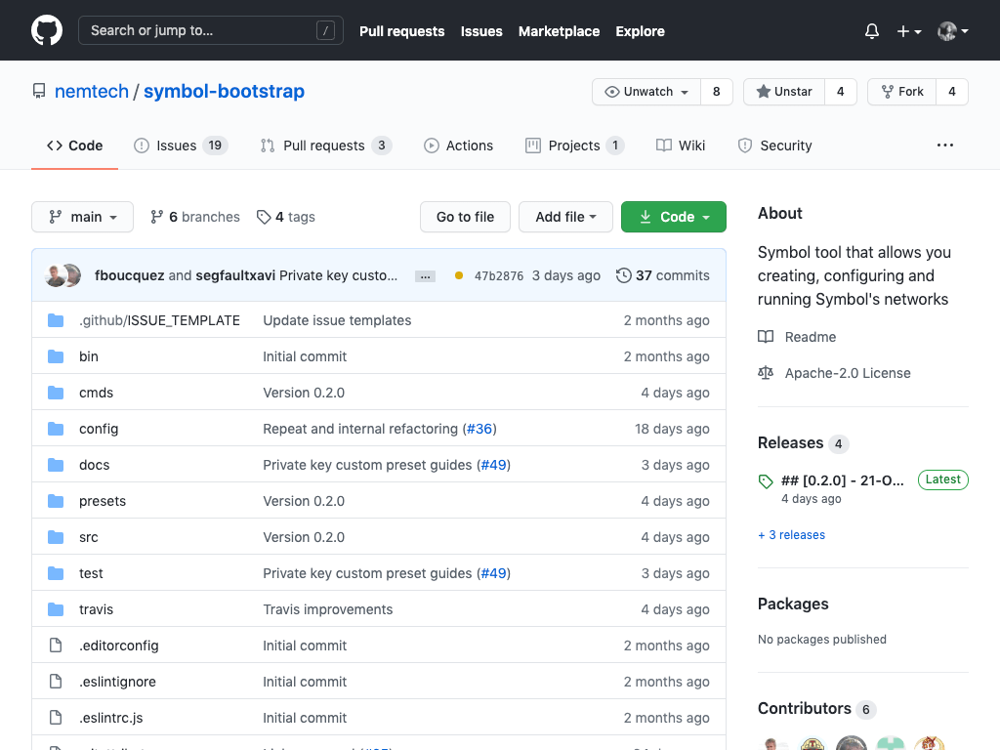
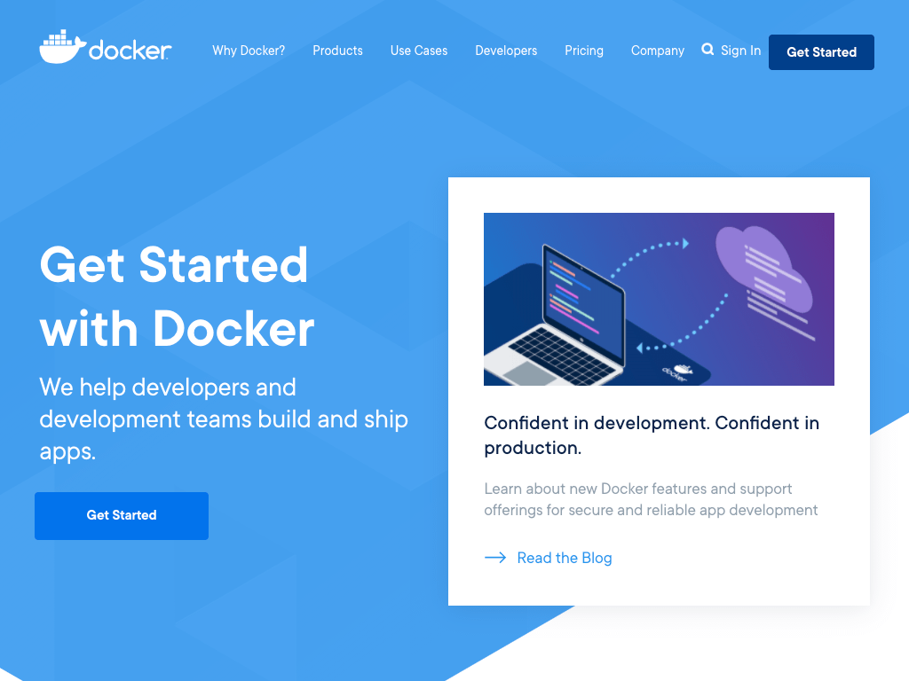
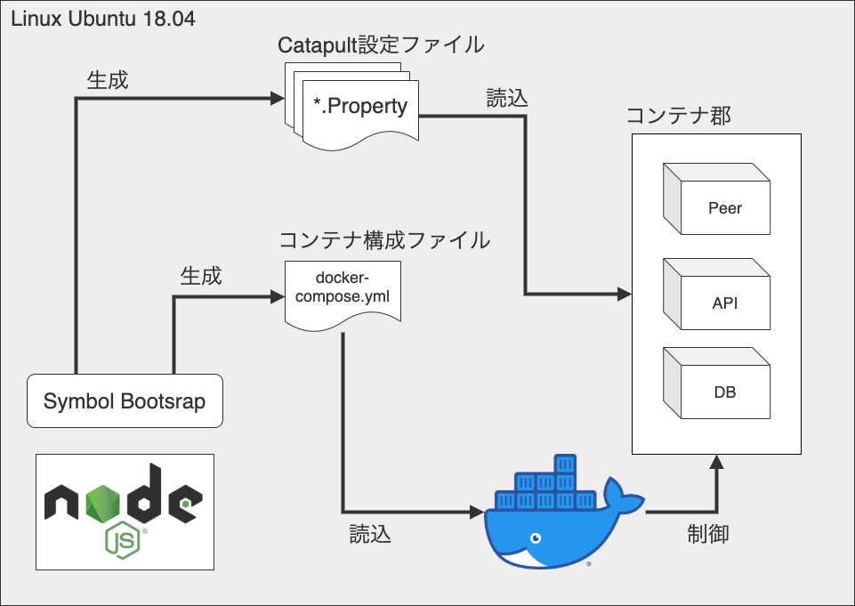
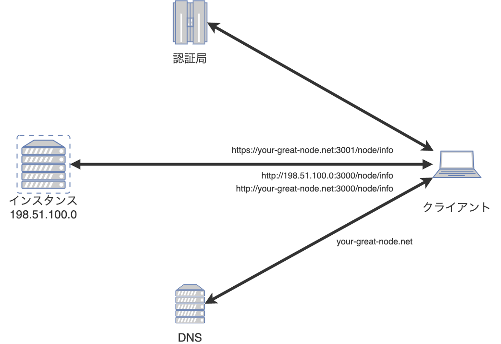
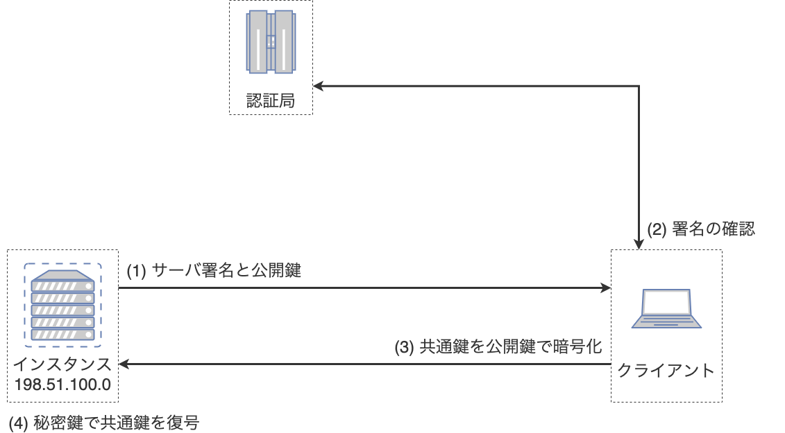
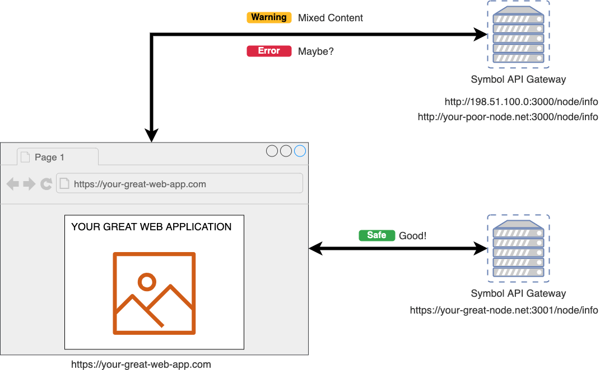
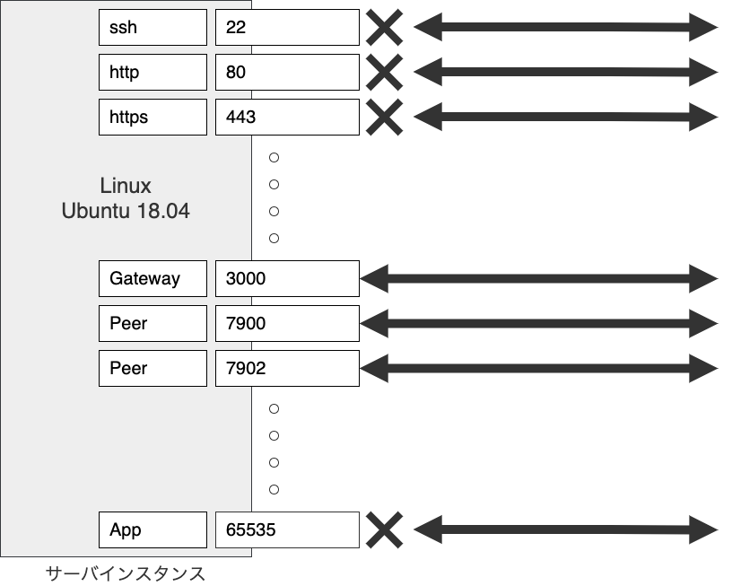

# Symbol TESTNET ノード構築ハンズオン

Date: 2020/11/14


---

## 自己紹介

よしゆき


- [ニズベールRさん \(@44uk\_i3\) / Twitter](https://twitter.com/44uk_i3)
- [次世代NEMではじめるブロックチェーンアプリケーション開発 \- nizveyl \- BOOTH](https://nizveyl.booth.pm/items/1549217)
    - Elephant 🐘
    - 購入「非推奨」！！！

---

## ハンズオンでやること

- 環境構築
- ノード起動設定ファイルの作成
- ノードの起動 / 停止
- サービス化の設定
- ドメイン設定 / HTTPS対応
- セキュリティ設定

---

### 資料について

- [44uk / symbol-testnet-node-running-hands-on](https://github.com/44uk/symbol-testnet-node-running-hands-on)

ハンズオン資料はこのリポジトリにて公開します。

- [Symbolテストネットノードを建ててみた \(v0\.10\.x Hippo on Ubuntu Server 18\.04\)](https://nemlog.nem.social/blog/49345)

基本的にはすでに公開済みのこちらの記事と同じです。

---



---

## 環境構築

- Node.js (プログラム言語)
- npm (Node.js のパッケージ管理ツール)
- Symbol Bootstrap (Symbol ノードの便利ツール)
- Docker (コンテナ型仮想化ツール)
- DockerCompose (Docker の便利ツール)

上記の動作に必要なソフトウェアのインストールを行います。


---

### Node.js / npm



- [Node\.js](https://nodejs.org/ja/)

プログラミング言語 JavaScript の実行環境。

---

### Symbol Bootstrap



- [nemtech/symbol\-bootstrap: Symbol tool that allows you creating, configuring and running Symbol's networks](https://github.com/nemtech/symbol-bootstrap)

Symbolプラットフォームの様々な起動設定構成を生成するツール。
JavaScript(Node.js)で動作する。

---

### Docker / Docker Compose



実行環境のコンテナ仮想化ツール。

---

### Node.js / npm をインストール

```shell
# curl -sL https://deb.nodesource.com/setup_14.x | sudo -E bash -
# apt-get install -y nodejs
# npm install -g npm@latest
```
`Node.js 14.x`をインストールして、`npm`をアップデートします。

```shell
# node -v
v14.12.0
# npm -v
6.14.8
```
バージョンを表示して、インストールを確認します。

---


### Symbol Bootstrap をインストール

```shell
# npm install -g symbol-bootstrap@alpha
```
`symbol-bootstrap`をインストールします。

```shell
# symbol-bootstrap -v
symbol-bootstrap@0.2.1-alpha-202010221020 linux-x64 node-v14.12.0
```
バージョンを表示して、インストールを確認します。

---

### Docker / DockerCompose のインストール

```shell
# apt-get update -y && apt-get upgrade -y

# apt-get install -y apt-transport-https ca-certificates curl gnupg-agent software-properties-common
# curl -fsSL https://download.docker.com/linux/ubuntu/gpg | apt-key add -
# apt-key fingerprint 0EBFCD88
# add-apt-repository "deb [arch=amd64] https://download.docker.com/linux/ubuntu $(lsb_release -cs) stable"
# apt-get update -y && apt-get install -y docker-ce docker-ce-cli containerd.io

# curl -L https://github.com/docker/compose/releases/download/1.27.4/docker-compose-$(uname -s)-$(uname -m) -o /usr/local/bin/docker-compose
# chmod +x /usr/local/bin/docker-compose
```
`docker`と`docker-compose`をインストールします。

```shell
# docker -v
Docker version 19.03.13, build 4484c46d9d
# docker-compose -v
docker-compose version 1.27.4, build 40524192
```
バージョンを表示して、インストールを確認します。

---



---

## ノード起動設定ファイルの作成

- Catapultサーバ / Rest用の設定
- docker-compose.yml の設定


---

### ファイルの設置場所

```shell
# mkdir -p /opt/symbol-bootstrap
# cd /opt/symbol-bootstrap
```

以後、`/opt/symbol-bootstrap`がカレントディレクトリを前提とします。

---

### カスタム設定の用意

```yaml
nodes:
    -
        friendlyName: __YOUR_FRIENDLY_NAME__
gateways:
    -
        throttlingBurst: 70
        throttlingRate: 40
```

`my-preset.yml`としてファイルを作成します。
これらはデフォルトの設定を上書きするための値です。

`friendlyName`: ノードに任意の名前をつけるための文字列
`throttlingBurst`: APIの同時接続数上限(デフォルト: 35)
`throttlingRate`: APIの秒間リクエスト数上限(デフォルト: 20)

---

#### エディタの操作が難しい場合のコピペ用

```shell
cat << _EOS_ >> my-preset.yml
nodes:
    -
        friendlyName: __YOUR_FRIENDLY_NAME__
gateways:
    -
        throttlingBurst: 70
        throttlingRate: 40
_EOS_
```

---

### 設定ファイル郡の生成

```shell
# symbol-bootstrap config -p testnet -a dual -c my-preset.yml
```

- `-p` プリセット(preset)
- `-a` アセンブリ(assembly)
- `-c` カスタム(customPreset)

テストネット向けの設定を、Peer+API(Dual)構成で、カスタムプリセット`my-preset.yml`を使用する。
`target/`ディレクトリが生成され、その中に設定ファイルがあります。

```shell
# ls
addresses.yml gateways/ nemesis/ nodes/ preset.yml
```

---

### Docker Composeファイルの生成

```shell
# symbol-bootstrap compose
```
`target/docker/`ディレクトリが作成され、Docker関連のファイルが作成されます。

---

## ノードの起動/停止


---

### ノードの起動

```shell
# symbol-bootstrap start -d
```
生成された設定ファイルでコンテナ郡を立ち上げます。
内部的には`docker-compose`が`target/docker/docker-compose.yml`に定義された
コンテナ郡を立ち上げています。初回の起動には1分程度かかります。

```shell
# symbol-bootstrap healthCheck
.
.
2020-10-17T09:19:20.359Z info     Network is running!
```
`healthCheck`で各コンテナが立ち上がっているかどうかをチェックできます。

---

### ノード稼働の確認

```shell
# curl http://localhost:3000/node/info
# curl http://localhost:3000/chain/info
```
`curl`で API ゲートウェイを叩いて確認してみます。

- http://__YOUR_SERVER_IP_ADDR__:3000/node/info
- http://__YOUR_SERVER_IP_ADDR__:3000/chain/info

外部から API ゲートウェイにアクセスしてみます。

---

#### テストネットノード一覧

- [symbol node list \(testnet\)](https://symbolnodes.org/nodes_testnet/)

時間が立つとこのサイトのノード一覧に掲載されてきます。
(更新間隔次第なので、後々見てみましょう)

---

### ノードの停止

```shell
# symbol-bootstrap stop
```
起動していることが確認できたらノードを止めてみます。
起動していたコンテナがすべて停止します。

```shell
# ls target/nodes/api-node/data
00000/ 00001/ index.dat proof.index.dat
```
同期したブロックデータは保存されているので、次回以降の起動で使い回されます。
`00000/`ディレクトリにブロックデータが保存されます。
`00001/`のように同期が進めば増えていきます。

---

## サービス化の設定

手動にてコンテナ郡を起動してきました。
コンテナ起動をサービス化することで、サーバの起動・終了時に連動させます。


---

### Systemd 設定ファイルの作成

```text
[Unit]
Description=Symbol Platform Node Daemon
After=docker.service
[Service]
Type=simple
WorkingDirectory=/opt/symbol-bootstrap
ExecStartPre=/usr/bin/symbol-bootstrap stop
ExecStartPre=-/bin/rm target/nodes/api-node/data/server.lock
ExecStartPre=-/bin/rm target/nodes/api-node/data/broker.lock
ExecStart=/usr/bin/symbol-bootstrap start
ExecStop=/usr/bin/symbol-bootstrap stop
TimeoutStopSec=120
Restart=on-failure
RestartSec=60
PrivateTmp=true
[Install]
WantedBy=default.target
```

`/etc/systemd/system/symbol-platform.service`としてファイルを作成します。

---

#### エディタの操作が難しい場合のコピペ用

```shell
cat << _EOS_ >> /etc/systemd/system/symbol-platform.service
[Unit]
Description=Symbol Platform Node Daemon
After=docker.service
[Service]
Type=simple
WorkingDirectory=/opt/symbol-bootstrap
ExecStartPre=/usr/bin/symbol-bootstrap stop
ExecStartPre=-/bin/rm target/nodes/api-node/data/server.lock
ExecStartPre=-/bin/rm target/nodes/api-node/data/broker.lock
ExecStart=/usr/bin/symbol-bootstrap start
ExecStop=/usr/bin/symbol-bootstrap stop
TimeoutStopSec=120
Restart=on-failure
RestartSec=60
PrivateTmp=true
[Install]
WantedBy=default.target
_EOS_
```

---

### 設定の読み込みとサービスの有効化

```shell
# systemctl daemon-reload
# systemctl enable symbol-platform
```

再起動してみて、OS起動後に立ち上がっていることを確認してみましょう。

```shell
# reboot
```

---

### Systemctl コマンド

```shell
# systemctl start symbol-platform
# systemctl stop symbol-platform
# systemctl reload symbol-platform
# systemctl disable symbol-platform
# systemctl daemon-reload
```

以降はノードの起動 / 停止はサービス経由で行います。
1. 起動
2. 停止
3. 再起動(stopの後にstartが動く)
4. サービス登録を削除
5. `symbol-platform.service`を編集した場合に反映する


---

## ドメイン設定 / HTTPS対応

ドメイン名を取得し、`https-portal`というDockerコンテナを使用して、HTTPSに対応します。


---



---



---



---

### コンテナ設定の追記

```yaml
    https-portal:
        container_name: https-portal
        image: steveltn/https-portal:1
        ports:
            - "80:80"
            - "3001:443"
        restart: 'on-failure:2'
        environment:
            WEBSOCKET: 'true'
            STAGE: production
            DOMAINS: '__YOUR_GREAT_DOMAIN_NAME__ -> http://rest-gateway:3000'
        depends_on:
            - rest-gateway
```
`target/docker/docker-compose.yml`を開き、`rest-gateway:`の後ろに追記します。

---

### 設定ファイルの変更

```
host = __YOUR_GREAT_DOMAIN_NAME__
```
`target/nodes/api-node/userconfig/resources/config-node.properties`を開き、
`host`の部分に取得したドメイン名を入力します。

---

### ノードの再起動

```shell
# systemctl restart symbol-platform
```
`Symbol`関連のコンテナ郡が再起動すると同時に、
追加した`https-portal`コンテナが自動的に証明書の取得から設定までを行います。

---

### https通信の確認

- https://__YOUR_GREAT_DOMAIN_NAME__:3001/node/info
- https://__YOUR_GREAT_DOMAIN_NAME__:3001/chain/info

HTTPSでアクセスできることを確認します。

---

## セキュリティ設定


サーバの運用に付き物の、サーバセキュリティについて、最小限で効果の高い対策を施します。

---



---

### ファイアウォールでポートをすべて閉じる

```shell
# ufw --force enable
# ufw default DENY
# ufw reload
```

サーバはSymbolノードだけに使用するため、ポートをすべて閉じてしまいます。
サーバへのログインはVPSサービスが提供するコンソールを使用するので、
sshも閉じてしまいます。
ログインする術が無いので不正ログインの可能性もなくなります。

Symbolノードが使用するポート(3000,7900,7902)は、
Dockerの仕様上、ファイアウォールの設定を超えて、
通信可能となるので問題ありません。

---

### 他の対策

- sshログインポートの変更
- fail2banなどの導入
- Swatchなどの導入
- 実行ユーザーの切り分け

---

## Thank you for joining us!


よき農奴ライフを！
